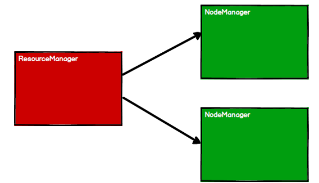
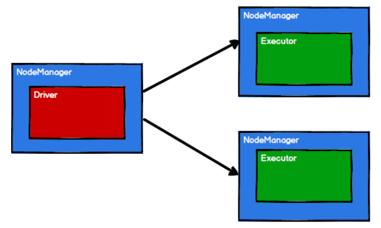
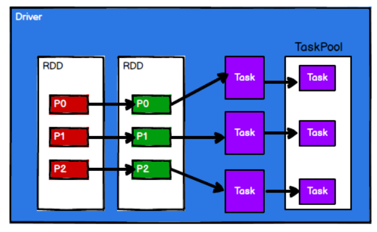
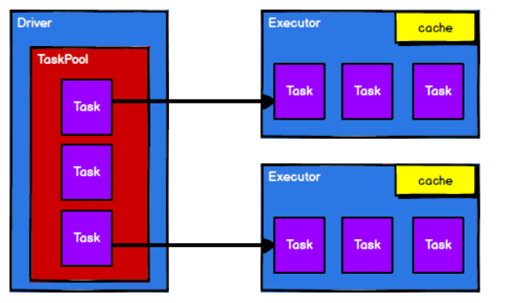

### spark 核心编程

#### 1、RDD

RDD（resilient distributed dataset）叫做分布式数据集，是spark中最基本的数据处理模型，代码中的一个抽象类，它代表一个弹性的、不可变、可分区、里面的元素可并行计算你的集合。

**弹性**

* 存储的弹性： 内存与磁盘的自动切换；
* 容错的弹性： 数据丢失可自动恢复
* 计算的弹性： 计算出错重试机制
* 分片的弹性：可根据需要重新分片

**分布式：**数据存储在大数据集群不同的节点上

**数据集：** RDD封装计算逻辑，并不保存数据

**数据抽象：** RDD是一个抽象类，需要子类具体实现

**不可变：** RDD封装了计算逻辑，是不可改变的，想要改变，只能产生新的RDD,在新的RDD里面封装了计算逻辑。

**可分区、并行计算**

**1） 核心属性**

* 分区列表 rdd数据结构中存在分区列表，用于执行任务时并行计算，是实现分布式计算的重要属性。
* 分区计算函数 spark在计算时，是使用分区函数对每一个分区进行计算
* RDD之间的依赖关系 RDD时计算模型的封装，当需求需要将多个计算模型进行组合时，就需要将多个RDD建立依赖关系。
* 分区器 当数据为kv类型数据时，可以通过设定分区器自定义的数据的分区
* 首选位置（可选）计算数据时，可以根据计算节点的状态选择不同的节点位置进行计算

**2） 执行原理**

从计算的角度来说，数据处理过程中需要计算资源（内存 & CPU）和计算模型（逻辑）。执行时，需要将计算资源和计算模型进行协调和整合。

Spark框架在执行时，先申请资源，然后将应用程序的数据处理逻辑分成一个一个的计算任务。然后将任务发到已经分配资源的计算节点上，按照指定的计算模型进行数据计算。最后得到统计结果。

RDD时spark框架中用于数据处理的核心模型。

**YARN 执行**

* 启动yarn集群环境

  

* spark通过申请资源创建调度节点和计算节点

  

* spark框架根据需要将计算逻辑根据分区划分成不同的任务

  

* 调度节点将任务根据计算节点状态发送到对应的计算节点进行计算

从以上的流程可以看出RDD在整个流程中用于将逻辑进行封装，并生成Task发送给Executor节点执行计算。

**RDD并行度与分区**

默认情况下，Spark可以将一个作业切分多个任务后，发送给Executor节点计算，而能够并行计算的任务数量我们称为并行度。这个数量可以构建RDD时指定。注意，这里的并行执行的任务数量，并不是的切分任务的数量。

* 读取内存数据时，数据可以按照并行度的设定进行数据的分区操作

  ~~~scala
  def positions(length: Long, numSlices: Int): Iterator[(Int, Int)] = {
   (0 until numSlices).iterator.map { i =>
   val start = ((i * length) / numSlices).toInt
   val end = (((i + 1) * length) / numSlices).toInt
   (start, end)
   }
  ~~~

* 读取任务数据时，数据是按照Hadoop文件读取的规则进行切分片分区，而切片规则和数据读取的规则有些差异，具体spark核心源码如下

  ~~~scala
  public InputSplit[] getSplits(JobConf job, int numSplits)
   throws IOException {
   long totalSize = 0; // compute total size
   for (FileStatus file: files) { // check we have valid files
   if (file.isDirectory()) {
   throw new IOException("Not a file: "+ file.getPath());
   }
   totalSize += file.getLen();
   }
   long goalSize = totalSize / (numSplits == 0 ? 1 : numSplits);
   long minSize = Math.max(job.getLong(org.apache.hadoop.mapreduce.lib.input.
   FileInputFormat.SPLIT_MINSIZE, 1), minSplitSize);
   
   ...
   
   for (FileStatus file: files) {
   
   ...
   
   if (isSplitable(fs, path)) {
   long blockSize = file.getBlockSize();
   long splitSize = computeSplitSize(goalSize, minSize, blockSize);
   ...
   }
   protected long computeSplitSize(long goalSize, long minSize,
   long blockSize) {
   return Math.max(minSize, Math.min(goalSize, blockSize));
   }
  ~~~

**RDD转换算子**

RDD根据数据处理方式的不同将算子整体上分为value类型，双value类型和key-value类型。

* 1、 map

  函数签名：def map[U: ClassTag](f: T => U): RDD[U]

