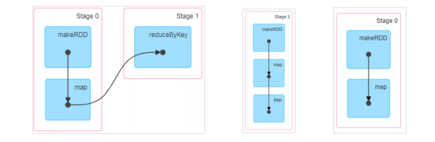
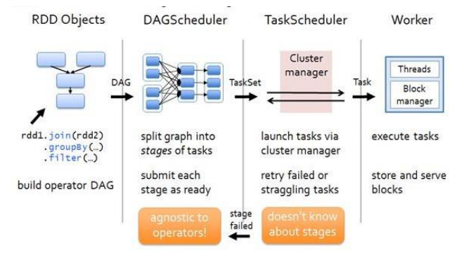

### spark 核心编程

#### 1、RDD

RDD（resilient distributed dataset）叫做分布式数据集，是spark中最基本的数据处理模型，代码中的一个抽象类，它代表一个弹性的、不可变、可分区、里面的元素可并行计算你的集合。

**弹性**

* 存储的弹性： 内存与磁盘的自动切换；
* 容错的弹性： 数据丢失可自动恢复
* 计算的弹性： 计算出错重试机制
* 分片的弹性：可根据需要重新分片

**分布式：**数据存储在大数据集群不同的节点上

**数据集：** RDD封装计算逻辑，并不保存数据

**数据抽象：** RDD是一个抽象类，需要子类具体实现

**不可变：** RDD封装了计算逻辑，是不可改变的，想要改变，只能产生新的RDD,在新的RDD里面封装了计算逻辑。

**可分区、并行计算**

**1） 核心属性**

* 分区列表 rdd数据结构中存在分区列表，用于执行任务时并行计算，是实现分布式计算的重要属性。
* 分区计算函数 spark在计算时，是使用分区函数对每一个分区进行计算
* RDD之间的依赖关系 RDD时计算模型的封装，当需求需要将多个计算模型进行组合时，就需要将多个RDD建立依赖关系。
* 分区器 当数据为kv类型数据时，可以通过设定分区器自定义的数据的分区
* 首选位置（可选）计算数据时，可以根据计算节点的状态选择不同的节点位置进行计算

**2） 执行原理**

从计算的角度来说，数据处理过程中需要计算资源（内存 & CPU）和计算模型（逻辑）。执行时，需要将计算资源和计算模型进行协调和整合。

Spark框架在执行时，先申请资源，然后将应用程序的数据处理逻辑分成一个一个的计算任务。然后将任务发到已经分配资源的计算节点上，按照指定的计算模型进行数据计算。最后得到统计结果。

RDD时spark框架中用于数据处理的核心模型。

**YARN 执行**

* 启动yarn集群环境

  

* spark通过申请资源创建调度节点和计算节点

  

* spark框架根据需要将计算逻辑根据分区划分成不同的任务

  

* 调度节点将任务根据计算节点状态发送到对应的计算节点进行计算


从以上的流程可以看出RDD在整个流程中用于将逻辑进行封装，并生成Task发送给Executor节点执行计算。


#### 2、RDD并行度与分区

默认情况下，Spark可以将一个作业切分多个任务后，发送给Executor节点计算，而能够并行计算的任务数量我们称为并行度。这个数量可以构建RDD时指定。注意，这里的并行执行的任务数量，并不是的切分任务的数量。

* 读取内存数据时，数据可以按照并行度的设定进行数据的分区操作

  ~~~scala
  def positions(length: Long, numSlices: Int): Iterator[(Int, Int)] = {
   (0 until numSlices).iterator.map { i =>
   val start = ((i * length) / numSlices).toInt
   val end = (((i + 1) * length) / numSlices).toInt
   (start, end)
   }
  ~~~

* 读取任务数据时，数据是按照Hadoop文件读取的规则进行切分片分区，而切片规则和数据读取的规则有些差异，具体spark核心源码如下

  ~~~scala
  public InputSplit[] getSplits(JobConf job, int numSplits)
   throws IOException {
   long totalSize = 0; // compute total size
   for (FileStatus file: files) { // check we have valid files
   if (file.isDirectory()) {
   throw new IOException("Not a file: "+ file.getPath());
   }
   totalSize += file.getLen();
   }
   long goalSize = totalSize / (numSplits == 0 ? 1 : numSplits);
   long minSize = Math.max(job.getLong(org.apache.hadoop.mapreduce.lib.input.
   FileInputFormat.SPLIT_MINSIZE, 1), minSplitSize);
   
   ...
   
   for (FileStatus file: files) {
   
   ...
   
   if (isSplitable(fs, path)) {
   long blockSize = file.getBlockSize();
   long splitSize = computeSplitSize(goalSize, minSize, blockSize);
   ...
   }
   protected long computeSplitSize(long goalSize, long minSize,
   long blockSize) {
   return Math.max(minSize, Math.min(goalSize, blockSize));
   }
  ~~~

#### 3、RDD转换算子

RDD根据数据处理方式的不同将算子整体上分为value类型，双value类型和key-value类型。

* 1、 map

  ~~~scala
   def map[U: ClassTag](f: T=> U):RDD[U]
  ~~~
  
  将处理的数据逐条进行映射转换，这里的转换可以是类型转换，也可以是值的转换。
  
* 2、mapPartitions

  ~~~scala
  def mapPartitions[U: ClassTag](f: Iterator[T] => Iterator[U], preservesPatitioning: Boolean = false): RDD[U]
  ~~~

  将待处理的数据以分区为单位发送到结算节点进行处理，这里的处理是指可以进行任意的处理，哪怕是过滤数据。

* 3、mapPartitionsWithIndex

  ~~~scala
  def mapPartitionsWithIndex[U: ClassTag](
   f: (Int, Iterator[T]) => Iterator[U],
   preservesPartitioning: Boolean = false): RDD[U]
  ~~~

  将待处理的数据以分区为单位发送到计算节点进行处理，这里的处理是指可以进行任意的处理，哪怕是过滤数据，在处理时可以获取当前分区索引。

* 4、flatMap

  ~~~scala
  def flatMap[U: ClassTag](f: T => TraversableOnce[U]): RDD[U]
  ~~~

* 5、glom

  ~~~scala
  def glom(): RDD[Array[T]]
  ~~~

  将同一个分区的数据直接转换为相同类型的内存数组Array，分区不变。

* 6、groupBy

  ```scala
  def groupBy[K](f: T => K)(implicit kt: ClassTag[K]): RDD[(K, Iterable[T])]
  ```

  将数据根据指定的规则进行分组，分区默认不变，但是数据会被打乱重新组合，我们将这样的操作称为shuffle。极限情况下，数据可能分在同一个分区中。

* 7、filter

  ```scala
  def glom(): RDD[Array[T]]
  ```

  将数据根据指定的规则进行筛选过滤，符合规则的数据保留，不符合规则的数据丢弃。当数据进行筛选过滤后，分区不变，但是分区内的数据可能不均衡，生产环境下，可能会出现数据倾斜。

* 8、sample

  ```scala
  def sample(
   withReplacement: Boolean,
   fraction: Double,
   seed: Long = Utils.random.nextLong): RDD[T]
  ```

  根据指定的规则从数据集中抽取数据。

  ~~~scala
  val dataRDD = sparkContext.makeRDD(List(
   1,2,3,4
  ),1)
  // 抽取数据不放回（伯努利算法）
  // 伯努利算法：又叫 0、1 分布。例如扔硬币，要么正面，要么反面。
  // 具体实现：根据种子和随机算法算出一个数和第二个参数设置几率比较，小于第二个参数要，大于不
  要
  // 第一个参数：抽取的数据是否放回，false：不放回
  // 第二个参数：抽取的几率，范围在[0,1]之间,0：全不取；1：全取；
  // 第三个参数：随机数种子
  val dataRDD1 = dataRDD.sample(false, 0.5)
  // 抽取数据放回（泊松算法）
  // 第一个参数：抽取的数据是否放回，true：放回；false：不放回
  // 第二个参数：重复数据的几率，范围大于等于 0.表示每一个元素被期望抽取到的次数
  // 第三个参数：随机数种子
  val dataRDD2 = dataRDD.sample(true, 2)
  ~~~

* 9、distinct

  ```scala
  def distinct()(implicit ord: Ordering[T] = null): RDD[T]
  def distinct(numPartitions: Int)(implicit ord: Ordering[T] = null): RDD[T]
  ```

  将数据中重复的数据去重。

* 10、coalesce

  ```scala
  def coalesce(numPartitions: Int, shuffle: Boolean = false,
   partitionCoalescer: Option[PartitionCoalescer] = Option.empty)
   (implicit ord: Ordering[T] = null)
   : RDD[T]
  ```

  根据数据量缩减分区，用于大数据集过滤后，提高小数据集的执行效率。

  当spark程序中，存在过多的小任务的时候，可以通过coalesce方法，收收缩和并分区，减少分区的个数，减少任务调度的成本。

* 11、repartition

  ```scala
  def repartition(numPartitions: Int)(implicit ord: Ordering[T] = null): RDD[T]
  ```

  该操作内部其实是执行的是coalesce操作，参数shuffle的默认值为true。无论是将分区数多的RDD转换为分区数少的RDD,还是将分区数少的RDD转换为分区数多的RDD,repartion操作都可以完成，因为无论如何都会经过shuffle过程。

* 12、sortBy

  ```scala
  def sortBy[K](
   f: (T) => K,
   ascending: Boolean = true,
   numPartitions: Int = this.partitions.length)
   (implicit ord: Ordering[K], ctag: ClassTag[K]): RDD[T]
  ```

  该操作作用于排序数据，在排序之前，可以将数据通过f函数进行处理，之后按照f函数处理的结果进行排序，

  默认为升序排列。排序后新产生的RDD的分区数雨原RDD的分区数一致。中间存在shuffle的过程。

  

  **双Value类型**：

* 13、intersection

  ```scala
  def intersection(other: RDD[T]): RDD[T]
  ```

  对源RDD和参数RDD求交集后返回一个新的RDD.

* 14、union

  ```scala
  def union(other: RDD[T]): RDD[T]
  ```

  对源RDD和参数RDD求并集返回一个新的RDD.

* 15、substract

  ```scala
  def subtract(other: RDD[T]): RDD[T]
  ```

  以一个RDD元素为主，去除两个RDD中重复元素，将其他元素保留下来，求差集。

* 16、zip

  ```scala
  def zip[U: ClassTag](other: RDD[U]): RDD[(T, U)]j
  ```

  将两个RDD中的元素，以键值对的形式进行合并，其中，键值对中的Key为第一个RDD的元素，Value为第2个RDD中相同位置的元素。

  

  **key-value类型**：

* 17、partitionBy

  ```scala
  def partitionBy(partitioner: Partitioner): RDD[(K, V)]
  ```

  将数据按照指定Partitioner重新进行分区，spark默认的分区器是HashPartitioner.

* 18、reduceByKey

  ```scala
  def reduceByKey(func: (V, V) => V): RDD[(K, V)]
  def reduceByKey(func: (V, V) => V, numPartitions: Int): RDD[(K, V)]
  ```

  可以将数据按照相同的key对value进行聚合。

* 19、groupByKey

  ```scala
  def groupByKey(): RDD[(K, Iterable[V])]
  def groupByKey(numPartitions: Int): RDD[(K, Iterable[V])]
  def groupByKey(partitioner: Partitioner): RDD[(K, Iterable[V])]
  ```

  将数据源的数据根据key对value进行分组。

  从 shuffle 的角度：reduceByKey 和 groupByKey 都存在 shuffle 的操作，但是 reduceByKey
  可以在 shuffle 前对分区内相同 key 的数据进行预聚合（combine）功能，这样会减少落盘的
  数据量，而 groupByKey 只是进行分组，不存在数据量减少的问题，reduceByKey 性能比较
  高。
  从功能的角度：reduceByKey 其实包含分组和聚合的功能。GroupByKey 只能分组，不能聚
  合，所以在分组聚合的场合下，推荐使用 reduceByKey，如果仅仅是分组而不需要聚合。那
  么还是只能使用 groupByKey。

* 20、aggregateByKey

  ```scala
  def aggregateByKey[U: ClassTag](zeroValue: U)(seqOp: (U, V) => U,
   combOp: (U, U) => U): RDD[(K, U)]
  ```

  将数据根据不同的规则进行分区内计算和分区间计算。

* 21、foldByKey

  ```scala
  def foldByKey(zeroValue: V)(func: (V, V) => V): RDD[(K, V)]
  ```

  当分区内计算规则和分区间计算规则相同时，aggrgateByKey就可以简化为foldByKey.

  

* 22、combineByKey

  ```scala
  def combineByKey[C](
   createCombiner: V => C,
   mergeValue: (C, V) => C,
   mergeCombiners: (C, C) => C): RDD[(K, C)]
  ```

  最通用的对key-value型rdd进行聚集操作的聚集函数，类似于aggregate(),combineByKey()允许用户返回值的类型与输入不一致。

* 23、sortByKey

  ```scala
  def sortByKey(ascending: Boolean = true, numPartitions: Int = self.partitions.length)
   : RDD[(K, V)]
  ```

  在一个（k,v）的RDD上调用，k必须实现Ordered接口（特质），返回一个按照key进行排序的。

* 24、join

  ```scala
  def join[W](other: RDD[(K, W)]): RDD[(K, (V, W))]
  ```

  在类型为（k,v）和（k,w）的rdd上调用，返回一个相同的key对应的所有元素链接在一起的（k,(v,w)）的RDD

* 25、leftOuterJoin

  ```scala
  def leftOuterJoin[W](other: RDD[(K, W)]): RDD[(K, (V, Option[W]))]def glom(): RDD[Array[T]]
  ```

  类似sql的语句的左连接

* 26、cogroup

  ```scala
  def cogroup[W](other: RDD[(K, W)]): RDD[(K, (Iterable[V], Iterable[W]))]
  ```

  在类型（k,v）和（k,w）的RDD上调用，返回一个（k,(Iterable<V>, Iterable<w>) ）类型的RDD


#### 4、RDD行动算子

* 1、reduce

  ```scala
  def reduce(f: (T, T) => T): T
  ```

  聚集RDD中的所有元素，先聚合分区内数据，再聚合分区间的数据

* 2、collect

  ```scala
  def collect(): Array[T]
  ```

  在驱动程序中，以数组Array的形式返回数据集的所有元素。

* 3、count

  ```scala
  def count(): Long
  ```

  返回RDD中元素的个数

* 4、first

  ```scala
  def first(): T
  ```

  返回RDD中的第一个元素

* 5、take

  ```scala
  def take(num: Int): Array[T]
  ```

  放回一个由RDD的前n个元素组成的数组。

* 6、takeOrdered

  ```scala
  def takeOrdered(num: Int)(implicit ord: Ordering[T]): Array[T]
  ```

  返回该RDD排序后的前n个元素组成的数组。

* 7、aggregate

  ```scala
  def aggregate[U: ClassTag](zeroValue: U)(seqOp: (U, T) => U, combOp: (U, U) => U): U
  ```

  分区的数据通过初始值和分区的数据进行聚合，然后再和初始值进行分区间的数据聚合。

* 8、fold

  ```scala
  def fold(zeroValue: T)(op: (T, T) => T): T
  ```

  折叠操作，aggregate的简化半版操作。

* 9、countByKey

  ```scala
  def countByKey(): Map[K, Long]
  ```

  统计每种key的数量。

* 10、sava

  ```scala
  def saveAsTextFile(path: String): Unit
  def saveAsObjectFile(path: String): Unit
  def saveAsSequenceFile(
   path: String,
   codec: Option[Class[_ <: CompressionCodec]] = None): Unit
  ```

  将数据保存到不同的格式的文件中。

* 11、foreach

  ```scala
  def foreach(f: T => Unit): Unit = withScope {
   val cleanF = sc.clean(f)
   sc.runJob(this, (iter: Iterator[T]) => iter.foreach(cleanF))
  }
  ```

  分布式遍历RDD中的每个元素，调用指定函数。

#### 5、RDD序列化

**闭包检测**

从计算的角度，算子以外的的代码都是在Driver端执行，算子里面的代码都是在Executor端执行。那么在scala的函数式编程中，就会导致算子内经常会用到算子外的数据，这样就形成了闭包效果。如果使用的算子外的数据无法序列化，就意味着无法传值给Executor端执行，就会发生错误。所以需要执行任务计算前，检测闭包内的对象是否可以进行序列化，这个操作我们称之为闭包检测。

scala2.12版本后闭包编译方式发生了改变。

**序列化方法和属性**

从计算的角度，算子以外的代码都是在Driver端执行，算子里面的代码都是在Executor端执行。

**Kryo序列化框架**

Java的序列化能够序列化任何类，但是比价重（字节多），序列化后，对象的提交也比较大。Spark处于性能考虑，Spark2.0开始开始支持另一种kryo序列化机制。kryo速度时serializable 的10倍。当RDD在shuffle数据的时候，简单数据类型，、数组和字符串类型已经spark内部使用kryo来序列化。


#### 6、RDD的依赖关系

**RDD的血缘关系：**

RDD中支持粗粒度转换，即在大量记录上执行单个操作，将创建RDD的一系列Lineage（血统）记录下来，以便恢复丢时的分区。RDD的lineage会记录RDD的元数据信息和转换行为，当该RDD的部分分区数据丢失时，他可以根据这些信息开重新运算和恢复丢失的数据分区。

**RDD依赖关系：**

这里所谓的依赖关系，其实就是两个相邻RDD之间的关系。

**RDD窄依赖：**

窄依赖表示每一个父（上游）RDD的Partition最多被子（下游）RDD的一个Partition使用。窄依赖我们通常比喻为独生子女。

**RDD宽依赖：**

宽依赖表示同一个父（上游）RDd的Partition被多个（下游）RDD的一个Partition依赖。会有shuffle操作。宽依赖我们形象的比喻为多生。

**RDD阶段划分：**

DAG(Directed Acyclic Graph)有向无环图是由点和线组成的拓扑图形，该图形具有方向，不会闭环，例如，DAG记录了RDD的转换过程和任务阶段。



**RDD任务划分：**

RDD任务切分中间分为：Appliction、job、Stage、Task

* Appliction: 初始化一个SparkContext即生成一个Appliction
* Job： 一个Action算子就会生成一个Job
* Stage： stage等于宽依赖（shuffleDepenDency）的个数加1
* Task：一个stage阶段中，最后一个RDD的分区个数就是Task的个数。



**RDD任务划分源码**

~~~scala
val tasks: Seq[Task[_]] = try {
 stage match {
 case stage: ShuffleMapStage =>
 partitionsToCompute.map { id =>
 val locs = taskIdToLocations(id)
 val part = stage.rdd.partitions(id)
 new ShuffleMapTask(stage.id, stage.latestInfo.attemptId,
 taskBinary, part, locs, stage.latestInfo.taskMetrics, properties, 
Option(jobId),
 Option(sc.applicationId), sc.applicationAttemptId)
 }
 case stage: ResultStage =>
 partitionsToCompute.map { id =>
 val p: Int = stage.partitions(id)
 val part = stage.rdd.partitions(p)
 val locs = taskIdToLocations(id)
 new ResultTask(stage.id, stage.latestInfo.attemptId,
 taskBinary, part, locs, id, properties, stage.latestInfo.taskMetrics,
 Option(jobId), Option(sc.applicationId), sc.applicationAttemptId)
 }
 }
……
val partitionsToCompute: Seq[Int] = stage.findMissingPartitions()
……
override def findMissingPartitions(): Seq[Int] = {
mapOutputTrackerMaster
 .findMissingPartitions(shuffleDep.shuffleId)
 .getOrElse(0 until numPartitions)
}
~~~


#### 7、RDD的持久化

**RDD cache缓存：**

RDD通过cache或者Persist方法将前面的计算结果缓存，默认情况下会把数据以缓存在JVM的堆内存中。但是并不是这两个方法被调用时立即缓存，而是触发后面的action算子时，该RDD会被缓存在计算节点内存中，并供后面重用。

缓存有可能丢失，或者存储于内存数据由于内存不足而被删除，RDD的缓存容错机制保证了即使缓存丢失也能保证计算的正确执行。通过基于RDD的一系列转换，丢失的数据会被重算，由于RDD的各个partition是相对独立的，因此只需要计算丢失的部分即可，并不需要重算全部partion。

spark会自动对一些shuffle操作的中间数据进行持久化，比如reducebykey，这样做的目的时为了当一个节点shuffle失败了避免重新计算整个输入。但是，在实际的使用时候，如果想重用数据，仍然建议调用persist,cache.

**RDD checkPoint检查点：**

所谓的检查点其实就是通过将RDD中间结果写入磁盘

由于血缘依赖过长容易造成成本过高，这样不如在中间节点做检查点容错，如果检查点之后的节点出现了问题，可以从检查点开始重新做血缘，减少开销。

对RDD进行checkopint操作并不会马上执行，必须执行action操作才能触发。

**缓存和检查的区别：**

1、cache缓存只是将数据保存起来，不切断血缘依赖。checkopint检查点切断血缘依赖。

2、cache缓存的数据通常存储在磁盘、内存等地方，可靠性低。checkopint的数据通常存储在HDFS等容错、高可用的文件系统，可靠性高。

3、建议对checkopint 的RDD使用cache缓存，这样checkopint的job只需要从cache缓存中读取数据即可，否则需要重头计算一次RDD。


#### 8、RDD分区器

Spark目前支持Hash分区和Range分区，和用户自定义分区。

Hash分区为当前默认的分区。分区器直接决定了RDD中分区的个数、RDD中每条数据经过shuffle后进入那个分区，进而决定了Reduce的个数。

* 只有key-value类型的RDD才有分区器，非key-value 类型的RDD分区的值时None
* 每个RDD的分区ID范围： 0 ~ (numPartions -1)，决定了这个值是属于那个分区的。

**Hash分区：** 对于给定的key,计算hashCode，并除以分区的个数取余。

~~~scala
 require(partitions >= 0, s"Number of partitions ($partitions) cannot be 
negative.")
 def numPartitions: Int = partitions
 def getPartition(key: Any): Int = key match {
 case null => 0
 case _ => Utils.nonNegativeMod(key.hashCode, numPartitions)
 }
 override def equals(other: Any): Boolean = other match {
 case h: HashPartitioner =>
 h.numPartitions == numPartitions
 case _ =>
 false
 }
 override def hashCode: Int = numPartitions
}
~~~


**Range分区： ** 将一定范围的数据映射到一个分区中，尽量保证每个分区数均匀，而且分区间有序。

~~~scala
class RangePartitioner[K : Ordering : ClassTag, V](
 partitions: Int,
 rdd: RDD[_ <: Product2[K, V]],
 private var ascending: Boolean = true)
 extends Partitioner {
 // We allow partitions = 0, which happens when sorting an empty RDD under the 
default settings.
 require(partitions >= 0, s"Number of partitions cannot be negative but found 
$partitions.")
 private var ordering = implicitly[Ordering[K]]
 // An array of upper bounds for the first (partitions - 1) partitions
 private var rangeBounds: Array[K] = {
 ...
 }
 def numPartitions: Int = rangeBounds.length + 1
 private var binarySearch: ((Array[K], K) => Int) = 
CollectionsUtils.makeBinarySearch[K]
      def getPartition(key: Any): Int = {
 val k = key.asInstanceOf[K]
 var partition = 0
 if (rangeBounds.length <= 128) {
 // If we have less than 128 partitions naive search
 while (partition < rangeBounds.length && ordering.gt(k, 
rangeBounds(partition))) {
 partition += 1
 }
 } else {
 // Determine which binary search method to use only once.
 partition = binarySearch(rangeBounds, k)
 // binarySearch either returns the match location or -[insertion point]-1
 if (partition < 0) {
 partition = -partition-1
 }
 if (partition > rangeBounds.length) {
 partition = rangeBounds.length
 }
 }
 if (ascending) {
 partition
 } else {
 rangeBounds.length - partition
 }
 }
 override def equals(other: Any): Boolean = other match {
 ...
 }
 override def hashCode(): Int = {
 ...
 }
 @throws(classOf[IOException])
 private def writeObject(out: ObjectOutputStream): Unit = 
Utils.tryOrIOException {
 ...
 }
 @throws(classOf[IOException])
 private def readObject(in: ObjectInputStream): Unit = Utils.tryOrIOException 
{
 ...
 }
}
~~~


#### 9、 RDD文件读取和保存

 Spark 的数据读取及数据保存可以从两个维度来作区分：文件格式以及文件系统。
文件格式分为：text 文件、csv 文件、sequence 文件以及 Object 文件；
文件系统分为：本地文件系统、HDFS、HBASE 以及数据库。
➢ text 文件
// 读取输入文件
val inputRDD: RDD[String] = sc.textFile("input/1.txt")
// 保存数据
inputRDD.saveAsTextFile("output")
➢ sequence 文件
SequenceFile 文件是 Hadoop 用来存储二进制形式的 key-value 对而设计的一种平面文件(Flat 
File)。在 SparkContext 中，可以调用 sequenceFile[keyClass, valueClass](path)。
// 保存数据为 SequenceFile
dataRDD.saveAsSequenceFile("output")
// 读取 SequenceFile 文件
sc.sequenceFile[Int,Int]("output").collect().foreach(println)
➢ object 对象文件
对象文件是将对象序列化后保存的文件，采用 Java 的序列化机制。可以通过 objectFile[T: 
ClassTag](path)函数接收一个路径，读取对象文件，返回对应的 RDD，也可以通过调用
saveAsObjectFile()实现对对象文件的输出。因为是序列化所以要指定类型。
// 保存数据
dataRDD.saveAsObjectFile("output")
// 读取数据
sc.objectFile[Int]("output").collect().foreach(println)


### 累加器

**实现原理：**

累加器用来把Executor端变量信息聚合到Driver端，在Driver端中定义变量，在Executor端的每个Task都会得到这个变量的一份新的副本，每个task更新这些副本后的值后，传回Driver端进行merge.


### 广播变量

广播变量用来高效分发较大的对象，向所有的工作节点发送一个较大的只读值，以供一个或多个spark操作使用，比如，如果你的应用需要向所有的节点发送一个较大的只读查询表，广播变量用起来都很顺手。在多个并行操作中使用同一个变量，但是spark会为每个任务分别发送。


