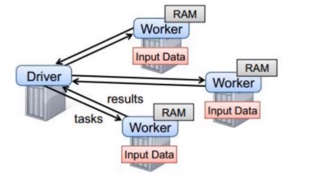
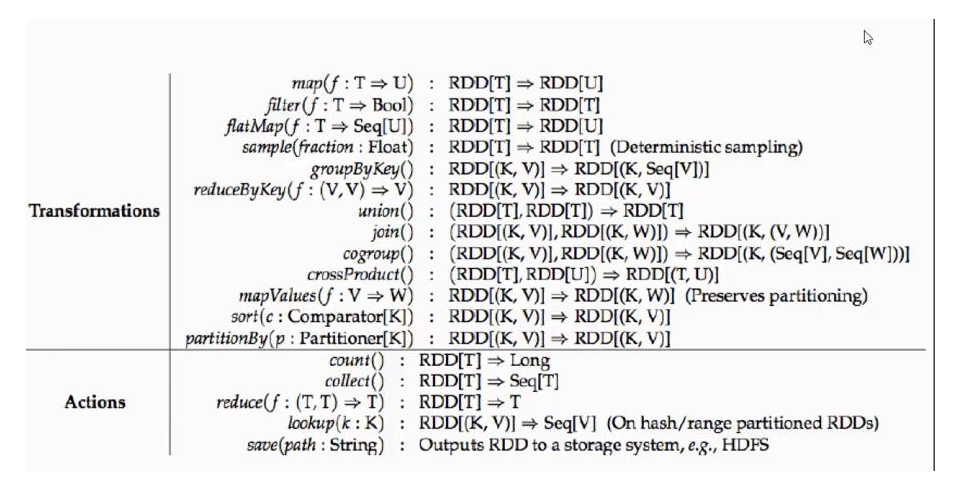
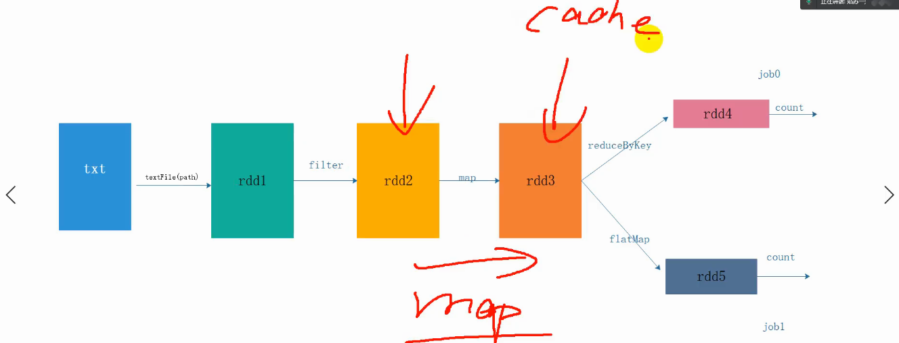
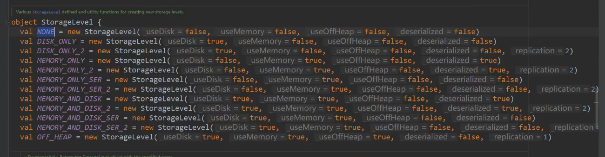
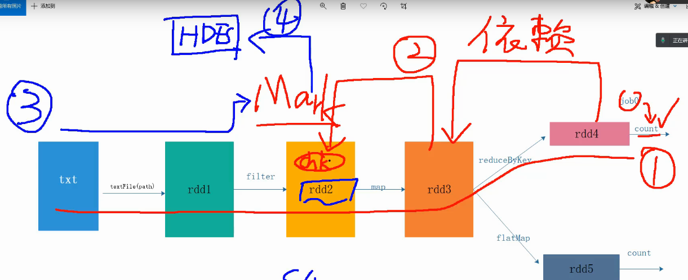

### Spark初始

### SparkCore

#### 1、RDD

#### 2、spark 任务执行原理

* standalone

  

  * 以上图有四个机器节点，Driver 和 Worker是启动在节点上的进程，运行在JVM中的进程。
  * Driver 与集群点之间有频繁的通信
  * Driver负责任务tasks 的分支和结果回收，即任务的调度，如果task的计算结果非常大那么就不要回收了。
  * Worker是Standalone资源调度框架里面的资源管理从节点，也是JVM进程。
  * Master是Standalone资源调度框架里面的资源管理的主节点，也是JVM进程。

#### 3、spark代码流程

* 1）创建配置文件，SparkConf 对象，说白了就是spark任务的相关配置
  * 可以设置application name
  * 可以设置运行的模式以及资源需求
*  2）基于SparkConf 创建SparkContext对象，即上下文环境对象，创建RDD,对RDD进行处理
*  3）应用程序Action 类算子来触发Transformation类算子执行
*  4）关闭Spark上下文对象

#### 4、算子

**常见算子如下图：**

* Transformations 转换算子

  * filter: 过滤符合条件的记录数，true保留，false过滤掉。
  * map: 将一个RDD中的每个数据项，通过map中的函数映射变为一个新的元素。特点：输入一条，输出一条。
  * flatMap：先map后flat,与map类似，每个输入项可以映射为0到多个输出项。
  * sample: 随机抽样算子，根据数据传进去的小数按比例进行有放回或无放回的抽样。
  * reduceByKey 将相同的key根据相应的逻辑进行处理。
  * sortByKey 、sorkBy 作用是在k、v格式的RDD上，对key进行升序或者降序排序。

* Action 行动算子  

  行动算子是触发了整个作业的执行。因为转换算子都是懒加载，并不会立即执行，行动算子执行后，才会触发计算。

  * reduce ：通过func函数聚集RDD中的所有元素，先聚合分区内数据，在聚合分区间的数据。
* collect  : 在驱动程序中，以数组的形式返回数据集的所有元素。
  
  * count   ：返回RDD中元素的个数
* first ：返回RDD的第一个元素
  
  * take(n)：返回RDD的前n个元素数组
* takeOrdered(n): 返回RDD排序后的前n个数据组成的数组
  
  * aggregate : (zeroValue: U)(seqOp: (U, T) ⇒ U, combOp: (U, U) ⇒ U),aggregate函数将每个分区里面的元素通过seqOp和初始值进行聚合，然后用combine函数将每个分区的结果和初始值(zeroValue)进行combine操作。这个函数最终返回的类型不需要和RDD中元素类型一致.
* saveAsTexFile(path): 将数据集的元素textfile的形式保存到hdfs或者其他文件系统，对于每个元素,spark将会调用toString方法，将他转换为文件的文本。
  
  * saveAsSequenceFile(path): 数据集中的元素以Hadoop sequencefile的格式保存到指定的目录下，可以使HDFS或者其他Hadoop支持的文件系统。
* saveAsObjectFile(path): 将数据集中的元素序列化为对象，存储到文件中。
  
  * countByKey(): 针对（k,v)类型的RDD,返回一个（k,Int）的map,表示每一个key对应的元素个数
* foreach(func) : 在数据集的每个元素上，运行函数func进行更新。
  

**注： 一个action就是一个job,job内部并行执行，job之间是串行。**

* 控制算子(持久化算子)

  * cache()  ->优化

    只放在内存,对RDD进行持久化到内存的操作（中间结果的持久化），能够提高性能。

    

  * persist()   ->优化

    可以指定持久化级别

    

    chache()=persist()=persist(StorageLevel.Memory_Only)

    persist和chache，persist记忆一些存储的级别，这两个算子多用作性能的优化。

  * checkpoint()  -> 容错

    checkpoint 将RDD持久化到磁盘，还可以切断RDD之间的依赖关系，也是懒执行。

    执行原理：

    * 1 当RDD的job执行完毕后，就会往前回溯。
    * 2 当回溯到某一个RDD调用了checkopint方法，会对当前的RDD做一个标记
    * 3 spark框架会对自动启动一个新的job,重新计算这个RDD的数据，将数据持久化到hdfs上。

    使用checkpoint 时常用的优化手段，对RDD执行的checkpoint之前，最好对这个RDD执行cache,这样新启动的job只需要将内存的数据拷贝到hdfs上就可以了，省去了重新计算这一步。

  ​       checkpoint使用需要设置数据存储路径，sc.setCheckpointDir(path)

### 补充部分算子

* transfromation 算子

  * join

    * leftOuterJoin
    * rightOuterJoin
    * fullOuterJoin

    这些join都是作用在k,v格式的RDD上，根据key值进行连接 ，比如：（k,v）join (k,w) 返回（k,(v,w)）

    注意：join后的分区数与父RDD分区数多的那个相同。

  * union

    合并连个数据集，两个数据集的类型要一致。

    返回新的RDD的分区数是合并RDD分区的总和。

  * instersection

    取两个数据集的交集

  * subtract

    取两个数据集的差集

  * mapPatitions

    mapPatition与map类似，单位是每个partition上的数量

  * distinct

    对RDD内的数据去重

  * cogroup

    

* action算子